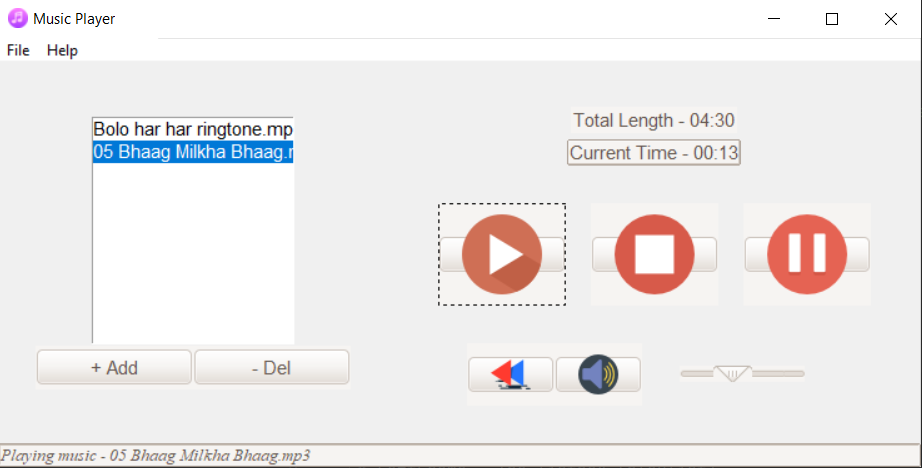

# Music Player App

This is a simple **Music Player App**  for listening audio songs written in Python with Tkinter and other useful Module like **pygame, mutagen** etc.
I built this project just for practice and fun purpose. 

# About Project
This application is totally based on GUI (Graphical User Interface) through which an user can interact with the application.
GUI is made up Graphical Components (Widgets) like buttons, labels, windows, Entry etc.
In this project we have used many predefined libraries for building GUI app.
 - **Tkinter** - It is a module in which there is a Class **Tk()**.In this class there is many methods Example - mainloop(), iconphoto(), title(), geometry(), resizable() etc.
  
## Features

- Creating a Menubar with the ability to open up files,Exit window and creating a help section. 
- Play song
- Stop song
- Pause/Unpause song
- Rewind/Restart song
- Mute/Unmute song
- Increase and Decrease volume of the song.
- Adding song to playlist
- Remove song from playlist
- Show Total length of the song.
- Show current timer when song is running.
- Show current song name at the bottom. 


## Output

<div align="center">
 
</div>

## Acknowledgements/Prerequisites

- First install Python extension (in Visual Studio code (VS Code))
- Install Python version latest
- python.exe path must be set in 'path' environment variable
- For more details link are given below:-
  - [Download Python](https://www.python.org/downloads/)
  - [Download Pycharm](https://www.jetbrains.com/pycharm/download/#section=windows)
  - [How to download Python and Pycharm](https://www.youtube.com/watch?v=mbryl4MZJms&ab_channel=Telusko)

## Music Player Icon
- [Flaticon](https://www.flaticon.com/)
- [ICO Converter](https://www.icoconverter.com/) 
- [ttkthemes (Advance Themes)]( https://ttkthemes.readthedocs.io/en/latest/)

## Installation

To Check Python is install or not,type
```bash
 python --version
```
To show all install packages,type
```bash
 pip freeze
```
    
